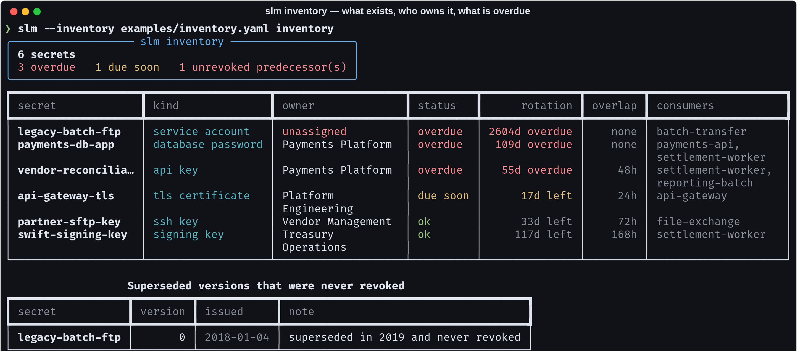
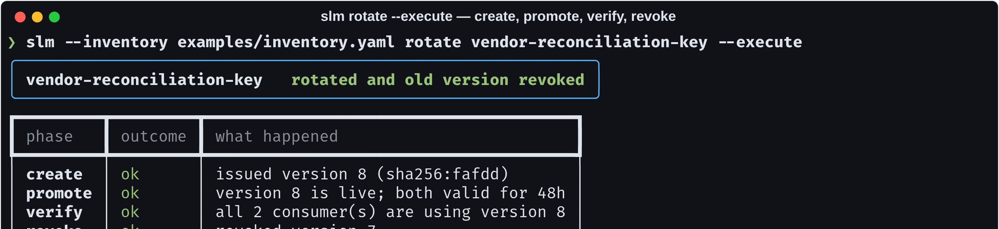
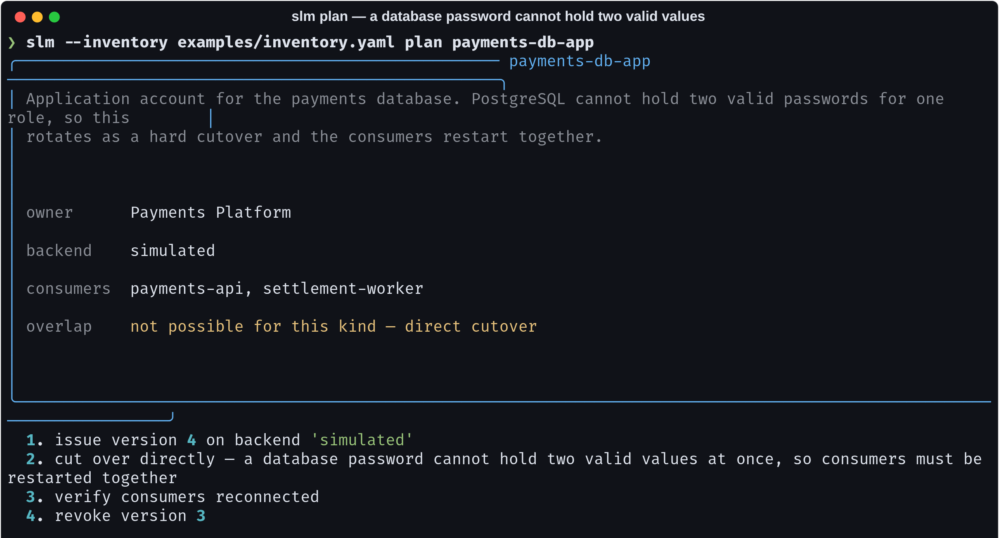
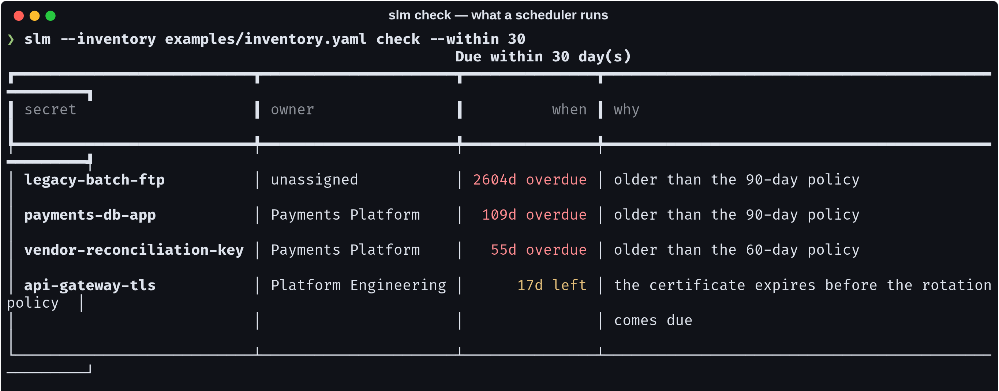

# secrets-lifecycle-manager

> Naive rotation is: generate a new value, write it where the old one was, done.
> It breaks every consumer that cached the old value, at the moment of rotation.
> Which is why rotation gets scheduled for a quiet Sunday, then postponed, and
> the credential is eight years old when it leaks.

[](https://github.com/Vincent-P-essy/secrets-lifecycle-manager/actions/workflows/ci.yml)
[](pyproject.toml)
[](tests)
[](src/slm/rotation.py)
[](LICENSE)

Rotation as a state machine with an overlap window, so it is a background task
rather than an outage — and it **will not revoke the old version until the
consumers are shown to have migrated**.



## Four phases, each abandonable

```
ACTIVE ──create──▶ PENDING ──promote──▶ OVERLAPPING ──revoke──▶ ACTIVE
                      │                      │
                      └──── discard ─────────┘   (nothing was switched)
```

| phase | what it costs to abandon here |
| --- | --- |
| **create** | one unused credential. Nothing points at it. |
| **promote** | nothing — the new version is discarded, the estate is as it was |
| **verify** | the step that gets skipped, and skipping it is what turns the next one into an outage |
| **revoke** | the only irreversible step, and the one most programmes never reach |



## The refusal that makes it safe

```
verify   failed    1 consumer(s) still using the old version: reporting-batch
revoke   skipped   old version left valid — revoking now would break those consumers
```

Verification means asking the **consumers** what they are using, not asking the
backend what it issued. The backend always knows about the new version — that
was step one. Whether the six services that cached the old value have picked it
up is a different question, and it is the one that decides whether revocation
is safe.

`--skip-verify` also skips revocation, and says so. Getting the old credential
actually revoked requires `--force-revoke` and meaning it.

## Not every secret can have an overlap



A PostgreSQL role holds one password. There is no overlap window to have, so the
plan says *"consumers must be restarted together"* rather than describing a
phase that cannot happen — and the loader zeroes an overlap configured on a kind
that cannot support one, instead of letting the plan lie.

That property belongs to the **system holding the secret**, not to the secret:
API keys, certificates, signing keys and SSH keys can hold two valid versions;
database passwords and most service accounts cannot.

## Rotation without revocation is not rotation

```
Superseded versions that were never revoked
  legacy-batch-ftp   v0   2018-01-04   superseded in 2019 and never revoked
```

The commonest gap in a real rotation programme: the new credential is issued and
adopted, and the old one is left valid forever. The count goes up, the exposure
goes up with it, and the dashboard is green. `slm inventory` and `slm check`
both surface it as a first-class finding.

## What a scheduler runs



```bash
slm check --within 30 --fail      # exit 1 when something is due
```

`why` distinguishes *"older than the 90-day policy"* from *"the certificate
expires before the rotation policy comes due"* — because a certificate carries
its own expiry, usually shorter than the policy, and the deadline is the earlier
of the two.

## The inventory never holds a secret

Only a `sha256:` fingerprint of each version, enough to verify a rotation
happened without the value ever entering this process. A file listing every
credential in the estate should not also contain them — and there is a CI step
asserting no issued value ever reaches the serialised inventory.

An **unowned secret is rejected at load time**: a secret nobody owns is a secret
nobody rotates, and the example inventory has one deliberately marked
`unassigned` so it shows up red.

## Install and run

```bash
git clone https://github.com/Vincent-P-essy/secrets-lifecycle-manager
cd secrets-lifecycle-manager
pip install -e .

slm --inventory examples/inventory.yaml inventory
slm --inventory examples/inventory.yaml plan payments-db-app
slm --inventory examples/inventory.yaml check --within 30
slm --inventory examples/inventory.yaml rotate vendor-reconciliation-key
slm --inventory examples/inventory.yaml rotate vendor-reconciliation-key --execute
```

## Backends

A backend is four methods — `create`, `promote`, `verify`, `revoke` — because
those are the four phases. A backend that can only create cannot be rotated
safely, and the missing method says so at import time rather than at 02:00.

`read-only` exists for credentials held somewhere this tool cannot write: a
partner's API key, a certificate another team issues. Rotation is still tracked
and still comes due; it is simply carried out by someone else, and saying that
is more useful than leaving the secret out of the inventory.

Wiring a real backend to Vault or AWS Secrets Manager is those four methods. The
state machine, the overlap window and the refusal to revoke unverified are what
this repository provides.

## Where this stops

- **The bundled backends are simulated.** They have the awkward parts a real one
  has — consumers that do not migrate, verification that can legitimately fail,
  a promotion that can be cleanly discarded — because those are what the state
  machine exists to handle.
- **No scheduler.** `slm check --fail` in cron or a pipeline; owning the
  scheduling would make this a platform rather than a tool.
- **Verification is as good as the backend's view of its consumers.** A backend
  that cannot enumerate them can only report them all as unmigrated, which fails
  safe.
- **The overlap window is wall-clock, not enforced.** Nothing here stops you
  revoking early; it just will not do it for you.

## Layout

```
src/slm/
  model.py      inventory, versions, states, expiry vs policy deadline
  rotation.py   the four-phase state machine and its refusals
  backends.py   the four-method interface, simulated and read-only
  cli.py        inventory · check · plan · rotate · backends
examples/inventory.yaml   six secrets, one unowned, one never revoked
```

## Licence

MIT
